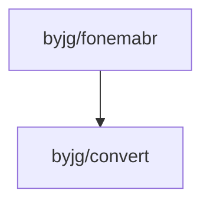

# Fonema BR

[](https://github.com/sponsors/byjg)
[](https://github.com/byjg/php-fonemabr/actions/workflows/phpunit.yml)
[](http://opensource.byjg.com)
[](https://github.com/byjg/php-fonemabr/)
[](https://opensource.byjg.com/opensource/licensing.html)
[](https://github.com/byjg/uri/releases/)

O Fonema BR tem por objetivo criar uma simplificação de palavras de tal forma que erros de ortografia e
vogais não interfiram na busca. Dessa forma, é possível criar sistemas de buscas mais aproximados com o
brasileiro e aumentar a assertividade da busca.

**Observação**: Apesar do nome "Fonema" a classe não é uma representação fiel dos fonemas brasileiros sendo
apenas uma simplificação.

*Nem todas as situações foram testadas. Caso encontre alguma divergência, por favor, sinta-se à vontade para
fazer um pull request*

## Installation

```bash
composer require byjg/fonemabr
```

[More details](docs/install.md)

## Exemplos

### Metafone

```php
$metaphone = new \ByJG\WordProcess\Portuguese\Metaphone();

echo $metaphone->convert('brasília'); // Output: BRAZILIA
echo $metaphone->convert('brazilia'); // Output: BRAZILIA
```

[More details](docs/metaphone.md)

### Soundex

```php
use ByJG\WordProcess\Portuguese\Soundex;

echo Soundex::process('brasília'); // Output: B625
echo Soundex::process('brazilia'); // Output: B625
echo Soundex::process('brasil');   // Output: B625
```

[More details](docs/soundex.md)

## Use Cases

Uma possível utilização é criar um segundo campo no banco de dados no qual o fonema será armazenado.
Sempre que salvar a palavra original você também salva a palavra com fonema.

Dessa forma você poderá pesquisar tanto a palavra original quanto a palavra simplifica com o Fonema.

[More details and examples](docs/use-cases.md)

## Dependencies



----
[Open source ByJG](http://opensource.byjg.com)
